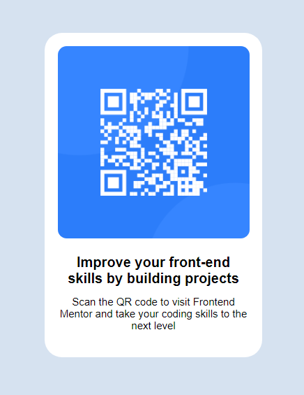

# QR-code-component

## Screenshots

## Built with
* HTML and CSS

## What I learned
* Dividing the projects into small parts to make it easier

## Acknowledgments
* Used the help of chatgpt (*@media screen*)
